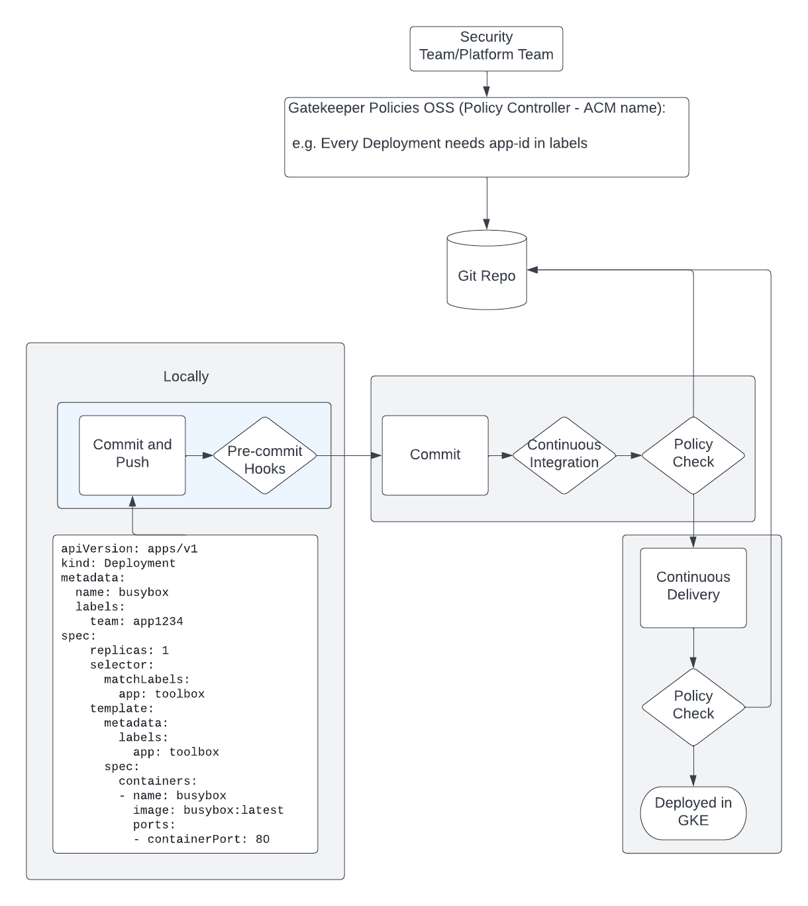
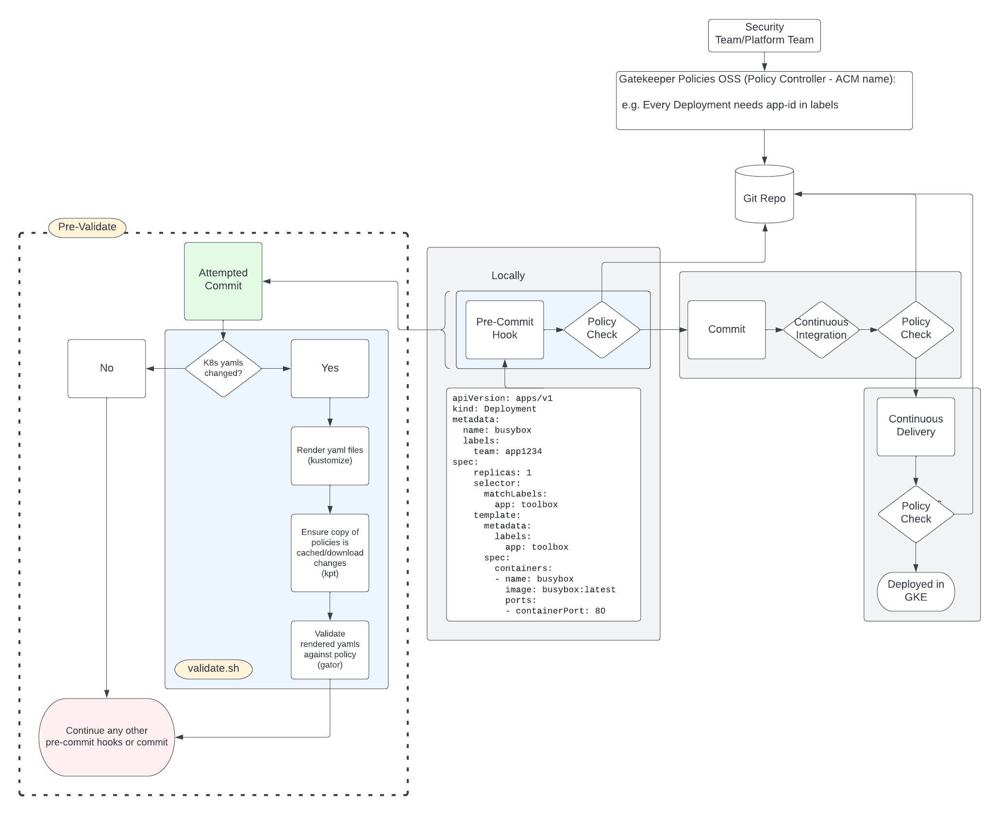
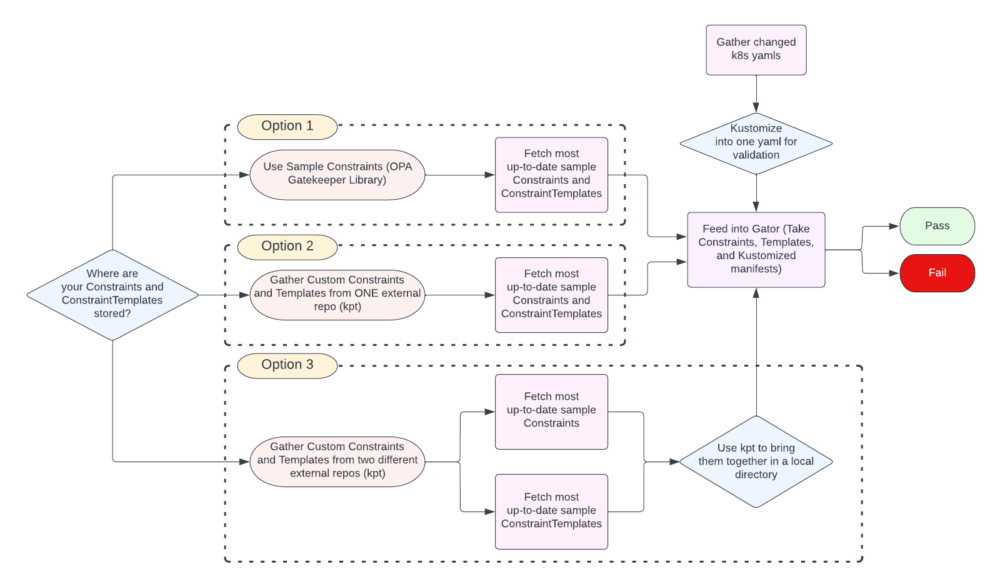

# Pre-Validate

Pre-Validate uses open-source tools to provide developers with a way to validate Kubernetes manifests before changes are pushed to a repository.

---

# Purpose

Organizations that deploy applications on Kubernetes clusters often use tools like __[Open Policy Agent](https://www.openpolicyagent.org/)__ (OPA) or __[Gatekeeper](https://open-policy-agent.github.io/gatekeeper/website/docs/)__ to enforce all kinds of security and operational policies. These are often essential for a company to meet government or legal requirements, but they have the added benefit of empowering their developers to create, by providing consistent feedback on their work. They have the freedom to try new things, understanding that something will step in if they overstep their boundaries.

Pre-Validate intends to streamline the development process by providing actionable feedback as quickly as possible. It can detect changed `.yaml` files, run policy validation on those files, and neatly display those errors to you so you can fix them. Typically, this step can occur in a CI/CD pipeline, or in a development cluster running Gatekeeper, or even in the repository, with automated code reviews. These methods are great, and using many in tandem is great for redundancy, but our goal is to reduce the potentially long wait times between when a developer submits their Kubernetes files and when those files either pass or fail policy reviews.

Here's what a typical CI/CD pipeline might look like with OSS Policy Validation built-in. In this case, we use Gatekeeper to define Constraints and ConstraintTemplates, and they are stored in a Git Repo that can be accessed by the pipeline (Jenkins, Google Cloud Build, etc.).



And what Pre-Validate does is extend these redundant validation steps into the developer's local development environment, like so:



---

# Important Things to Note

## Pre-Validate is an **Enhancement**, not a Replacement

We do not intend for Pre-Validate to replace other automated policy control systems. Instead, this is a project that can be used to help support developers who work on Kubernetes manifests by enhancing the delivery pipeline. Using Pre-Validate means you learn *if your deployments are going to fail* on the order of seconds, rather than minutes or hours.

The only thing that haapens if you don't use Pre-Validate to shift left on automated policy validation is it takes longer for you to learn if you have a problem. That's all!

## Handling Dependencies

Pre-Validate uses the follwing dependencies:

| Name | Role |
| ----- | -----|
| [kpt](https://kpt.dev/) | Enables us to fetch remote git repositories and use their contents in later steps. Kpt also provides easier integration with Kustomize. |
| [kustomize](https://github.com/kubernetes-sigs/kustomize) | Collates and hydrates raw yaml files into formats that work best with validation steps. |
| [gator](https://open-policy-agent.github.io/gatekeeper/website/docs/gator/) | Allows for evaluating Gatekeeper ConstraintTemplates and Constraints in a local environment. |

In order for Pre-Validate to work, these tools must be installed on your system. `setup.sh` will install or update each tool, and they will be accessible to the validation script via a dependency folder. if you'd like to handle installation yourself, you may! As long as the commands are in your `$PATH`, `validate.sh` will recognize and use them. In this case, when you run setup.sh, be sure to skip the dependency installation step. More details are provided in the setup instructions.

---

# Setting Up Pre-Validate

Using Pre-Validate is simple! From this repository, you only need to copy or clone over two files:

- `validate.sh`
- `setup.sh`

You can place these two files in the root directory of your project. It is important that you are in the same folder as your `.git` folder. This is because `setup.sh` will move `validate.sh` into your hooks from there.

From here, all you need to do is make both files executable, which is accomplished like this:
```
chmod +x setup.sh && \
chmod +x validate.sh
```
After this step, run `setup.sh`
```
./setup.sh
```
Answer the prompts, and then you're done!

Now, whenever you go to commit code and updated Kubernetes yaml files are found, Pre-Validate will test your changes against the policy constraints you've specified. Nifty!

---

# Technical Overview

Pre-Validate is intended to run as a pre-commit hook, so it has been designed with two distinct Bash scripts, `setup.sh` and `validate.sh`. **Here's what they do:**

**setup.sh**
1. Install or update dependencies.
2. Turn `validate.sh` into a pre commit hook.
3. Determine which Constraints/ConstraintTemplates to use, then save the URLs of the repositories/path to the local copies to a configuration file.

**validate.sh (Pre-commit Hook)**

1. When `git commit` runs, check if any yaml files have been updated.
2. Run `kustomize` to build a unified yaml file for evaluation.
4. Use kpt to gather Constraints and ConstraintTemplates and save them to a local folder.
3. Run `gator test`, which takes both the saved user configuration, including the Constraints/ConstraintTemplates fetched in the previous step, and the unified evaluation yaml file.
4. Fail the commit if violations are found. If there are no errors, continue the commit.

## Deep-Dive

Let's go a bit further into how everything works together. The idea is that you can run `setup.sh` whenever you need to change the behavior of your pre-commit script. This can include changes like:

- Updating Dependencies (which will happen automatically anytime you run `setup.sh`)
- Resetting the default behavior of your pre-commit hook, if you make changes that break the code.
- Describing new Constraints and/or ConstraintTemplates to use. We have a collection of samples from the [OPA Gatekeeper Library](https://github.com/open-policy-agent/gatekeeper-library) that you can use, but you can also supply your own repository. If you have separate repositories for your Constraints and Templates, that is also supported.

`validate.sh` depends `setup.sh` to take care of the more time-consuming steps in order to run as fast as possible. It's for this reason that `setup.sh` handles all aspects of setting up the environment, Then, `validate.sh` only needs to kustomize changed yamls, gather Constraints and ConstraintTemplates with kpt, and finally run `gator test` to produce an outcome.

When configured as a pre-commit script (taken care of by `setup.sh`), `validate.sh` will ask you which constraints and templates you want to use, the locations of which you provided in `setup.sh`, whether they're stored in one or two repositories, or if you want to continue with the sample policies in the OPA Gatekeeper Library. Here's how that decision flow works:




---


# Cleanup

Done with Pre-Validate? Uninstalling is easy! Since we installed dependencies from pre-compiled binaries, all we need to do is delete a few directories and files. You have two options here:

## Automatic Uninstall Using cleanup.sh

You can simply use `cleanup.sh`, which will automatically delete folders like `.oss_dependencies/` and any manifests, Constraints, or ConstraintTemplates that are still lingering around.

**IMPORTANT:** When you install Pre-Validate, it becomes `pre-commit` in the `.git/hooks/` directory. This script will delete the file, rather than renaming it by appending `.sample` to the filename.

## Manual Uninstall

To remove Pre-Validate, you must delete all of the files that have been created. This includes:

- `setup.sh`
- `.oss_dependencies/*` (which can be found in the root directory of your project)
- `.pre-validate-config/*` (which can be found in the same place, and contains your personal configurations)

Then, you must go into your .git/hooks/ folder, and either delete `pre-commit`, or add ".sample" to the end of the filename, which tells git not to run it in the future.

**We are working on a cleanup script that automates this process**

---

# Contact Info

We're always looking for help, or suggestions for improvement. Please feel free to reach out to us if you've got ideas or feedback!

- [Janine Bariuan](mailto:janinebariuan@google.com) 
- [Thomas Desrosiers](mailto:tdesrosi@google.com)